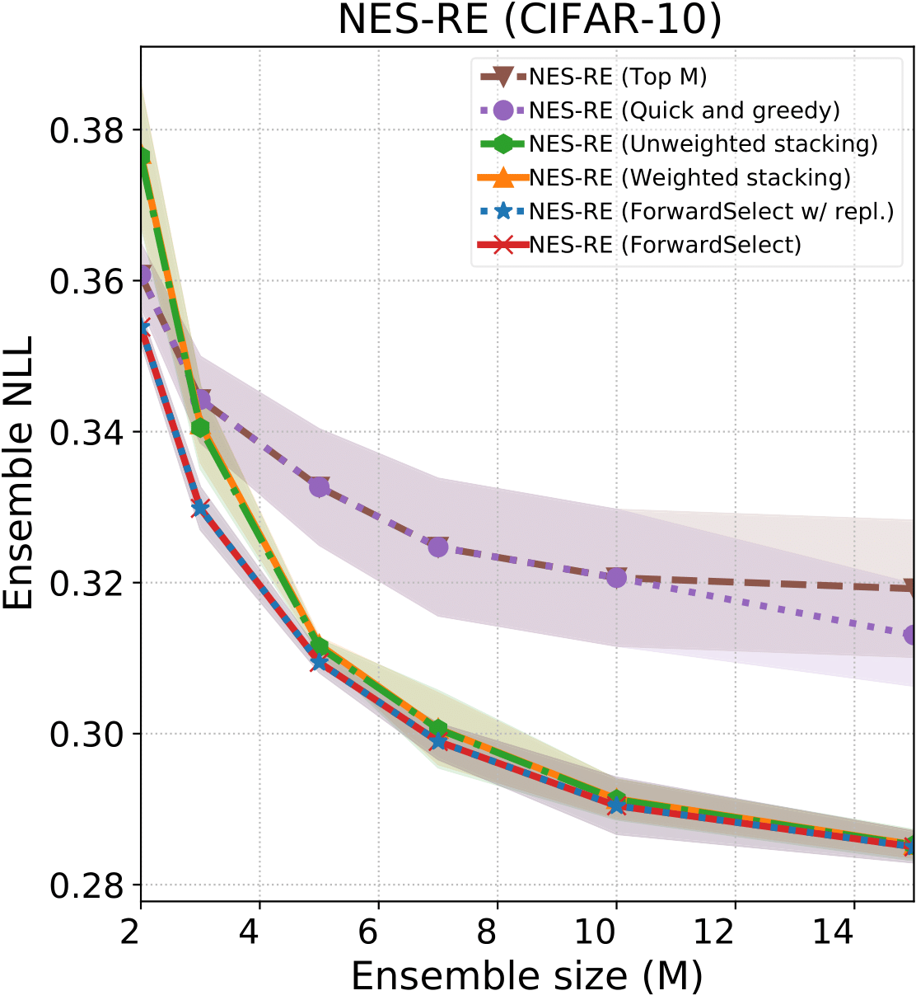
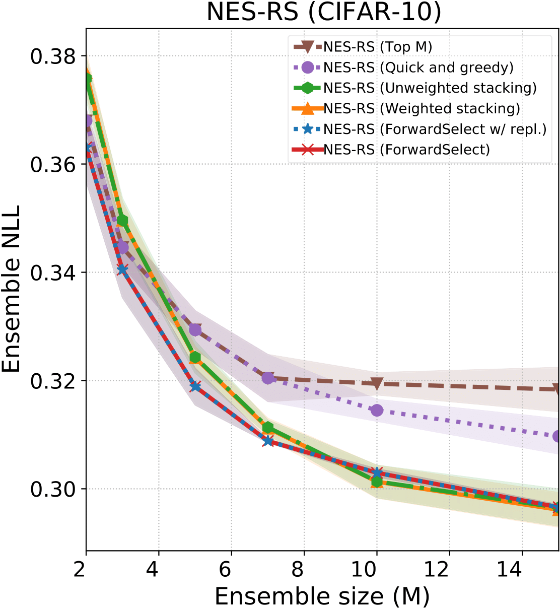
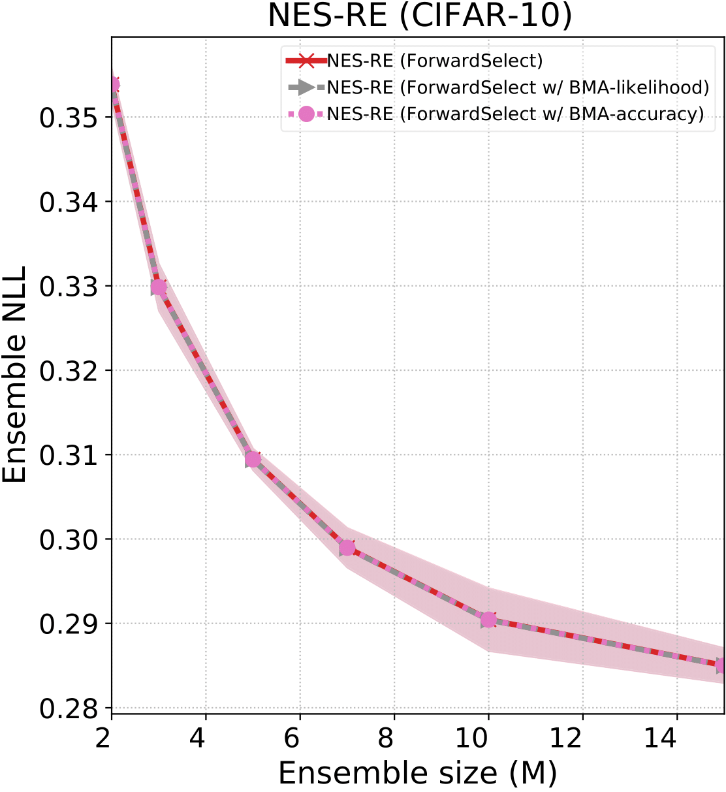
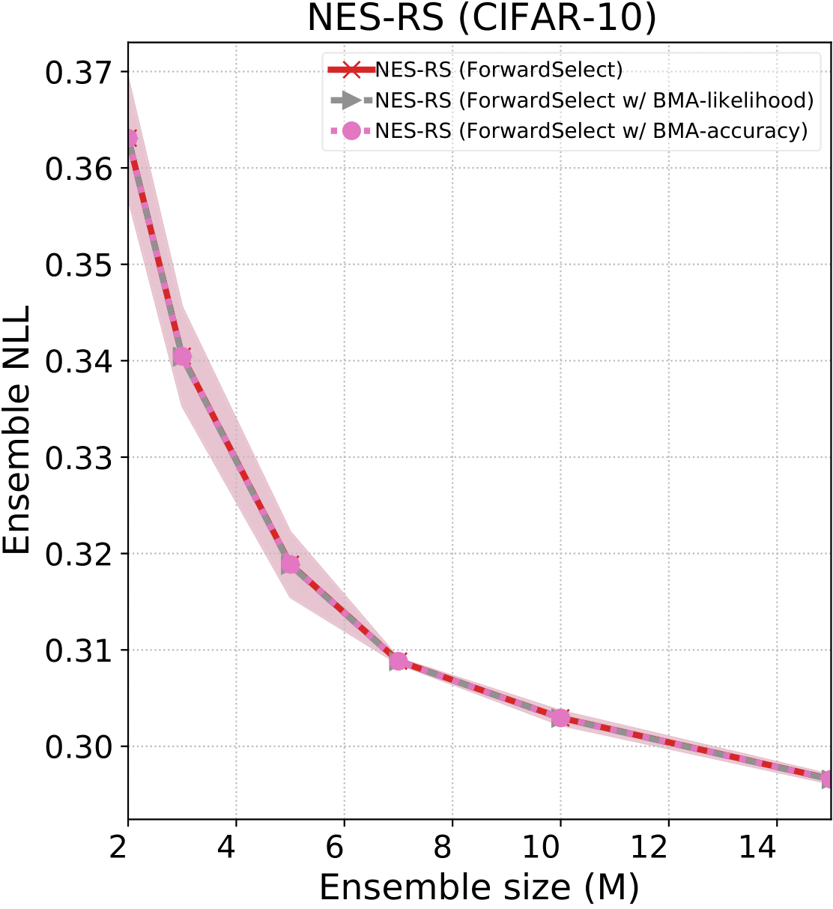
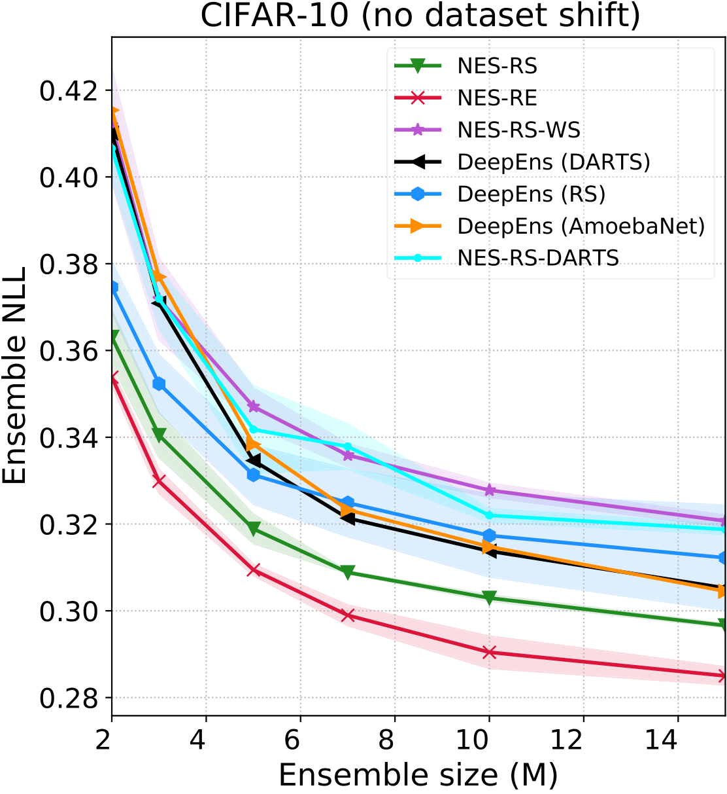
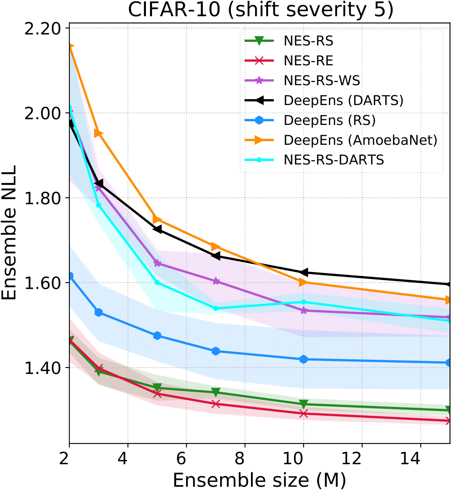
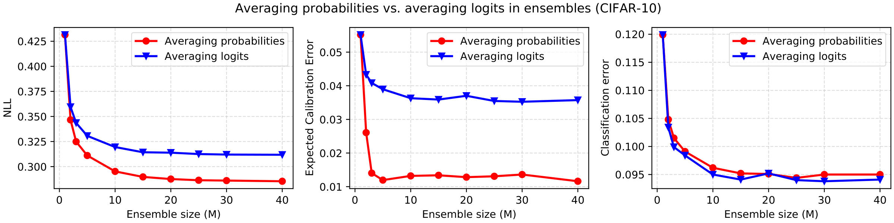
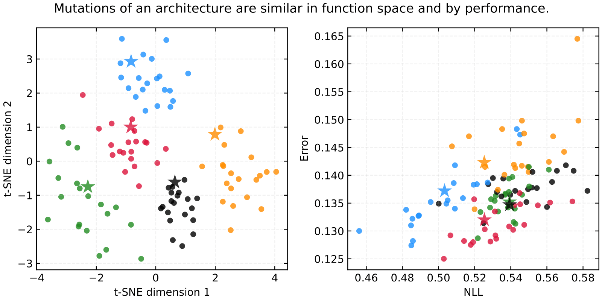
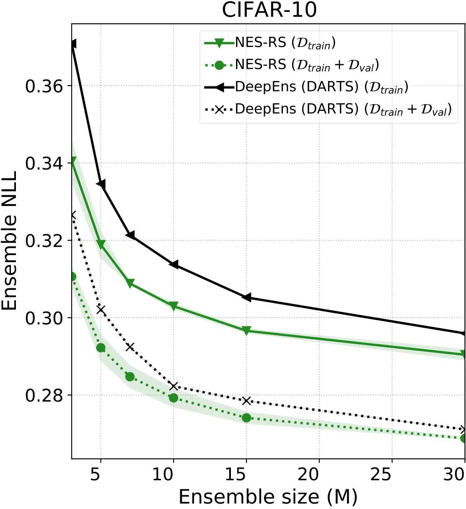
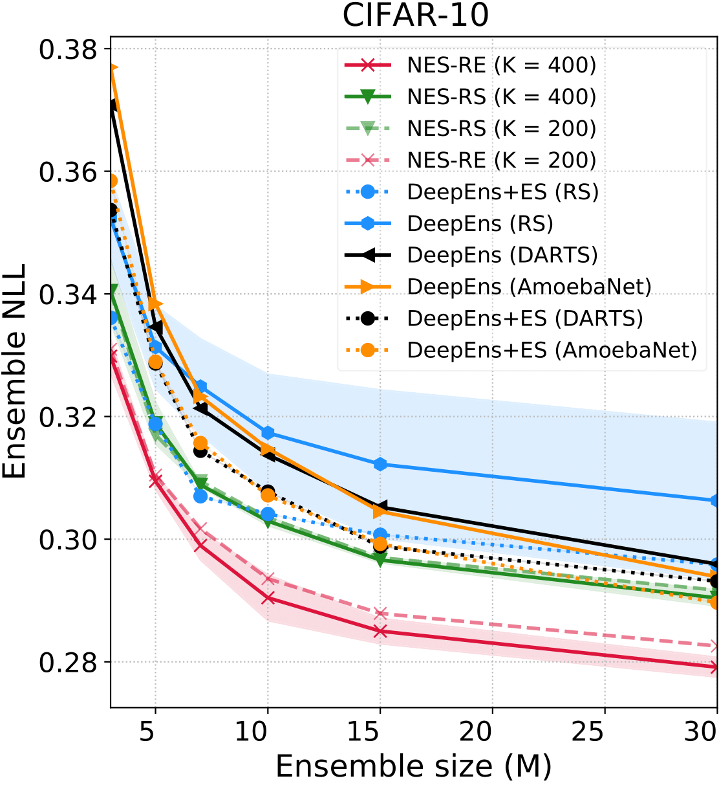

## Neural Ensemble Search: Figures for additional experiments requested by reviewers 

### Figure 1: Comparison of ensemble selection algorithms (reviewers dkBq, WTyi)

We have compared the performance of NES for different choices of the ensemble selection algorithm (ESA) used in stage 2 (ensemble selection from pool). In addition to our default ESA ForwardSelect, we have experimented now with the following seven choices:
* **Top M**: selects the top M (ensemble size) models by validation performance.
* **Quick and greedy**: Starting with the best network by validation performance, add the next best network to the ensemble only if it improves validation performance, iterating until the ensemble size is M or all models have been considered (returning an ensemble of size at most M).
* **ForwardSelect with replacement**: ForwardSelect but with replacement which allows repetitions of base learners.
* **Weighted stacking**: We linearly combine all base learners in the pool with learned stacking weights (which are positive and sum to 1). We keep only the base learners with the M largest stacking weights and weight them using the renormalized learned stacking weights.
* **Unweighted stacking**: We linearly combine all base learners in the pool with learned stacking weights (which are positive and sum to 1). We keep only the base learners with the M largest stacking weights and combine them by a simple, unweighted average.
* **ForwardSelect with Bayesian model averaging by likelihood**: We select the base learners in the ensemble using ForwardSelect, then we take a take a average weighted by the (normalized) validation likelihoods of the base learners. 
* **ForwardSelect with Bayesian model averaging by accuracy**: We select the base learners in the ensemble using ForwardSelect, then we take a take a average weighted by the (normalized) validation accuracies of the base learners.

To avoid clutter, the last two ESAs are shown in the bottom two plots, the rest are in the upper two plots.

**Takeaways**:
1. ForwardSelect performs better than or at par with all ESAs considered here (as we claimed in line 204). 
2. Stacking tends to perform competitively but still worse than ForwardSelect, and whether weighted averaging is used or not has a very minor impact on performance, since the learned weights tend to be close to uniform.
3. Bayesian model averaging (BMA) also has a very minor impact (almost invisible in the plot), because the likelihoods and accuracies of individual base learners are very similar (a consequence of multi-modal loss landscapes in neural networks with different models achieving similar losses) hence the BMA weights are close to uniform. The NLL achieved by the BMA ensemble only differed at the 4th or 5th decimal places compared to unweighted ensembles with the same base learners.

NES-RE | NES-RS
:-------------------------:|:-------------------------:
 | 
| 

### Figure 2: Generating the architecture pool using weight-sharing NAS algorithms (reviewer dkBq)

We generated the pool using the weight sharing schemes proposed by Random Search with Weight Sharing (Li & Talwalkar, 2019) and DARTS (Liu et al., 2019). Specifically, we trained one-shot weight-sharing models using each of these two algorithms, then we sampled architectures from the weight-shared models uniformly at random to build the pool. Next we ran ForwardSelect as usual to select ensembles from these pools. Finally, we retrained the selected base learners from scratch using the same training pipeline as NES and deep ensemble baselines. These results of these methods are referred to as NES-RS-WS and NES-RS-DARTS respectively in the figure below. The performance is worse than NES-RS and NES-RE, even though the computation cost is reduced significantly. This is likely due to the low correlation between the performance of the architectures when evaluated using the shared weights and the performance when re-trained in isolation. Prior work has shown this is caused by weight interference and coadaptation which occurs during the weight-shared model’s training (Yu et al., 2019; Zela et al., 2020).

Li & Talwalkar, 2019: Random Search and Reproducibility for Neural Architecture Search\
Liu et al., 2019: DARTS: Differentiable Architecture Search\
Yu et al., 2019: Evaluating the Search Phase of Neural Architecture Search\
Zela et al., 2020: NAS-Bench-1Shot1: Benchmarking and Dissecting One-shot Neural Architecture Search

No dataset shift | Dataset shift with severity 5/5
:-------------------------:|:-------------------------:
 | 

### Figure 3: Averaging logits vs. averaging probabilities in an ensemble (reviewer dkBq)

The following figure shows that ensembles constructed by averaging the logits underperform ensembles constructed by averaging the probabilities. In particular, the NLL and ECE achieved by logit-averaged ensembles is worse, whereas classification error remains broadly the same. 

### Figure 4: Analysis of architecture mutations in function space and by performance (reviewer WTyi)

We sampled five random architectures from the DARTS space, and for each one, we applied a single random mutation twenty times, yielding a “family” of parent-children architectures, which are then trained on CIFAR-10. In the left plot below, t-SNE is applied to the test predictions of these architectures, where each color corresponds to one “family”, of which the “star” is the parent architecture and the circles are the children architectures. The clustering demonstrates that architectures which differ by only a single mutation are similar in function space after training. The right plot shows the NLL and error achieved by these architectures. Again, similar clustering shows that architectures differing by a single mutation also perform similarly w.r.t. NLL and error. 

### Figure 5: Training architectures on D_train + D_val (reviewer dkBq)

We trained the ensembles constructed by NES and the best performing deep ensemble baseline, DeepEns (DARTS), on D_train + D_val, finding that both ensembles improve since the base learners improve due to more training data. Note that, as shown in Appendix C.5, the performance of ensemble selection (which uses D_val) is relatively insensitive to the size od D_val. Therefore, one way to bypass the additional cost of having to retrain the ensembles on D_train + D_val is to simply pick a very small D_val, such that the performance of the models when trained on D_train + D_val is approximately the same as when trained on D_train. 

### Figure 6: Ablation study comparing NES with deep ensembles + ensemble selection on a second dataset, CIFAR-10 (reviewer xqD9)

We conducted the ablation study in Figure 7 of our paper (which is done on Tiny ImageNet) on a second dataset, CIFAR-10, where we compare NES ensembles to deep ensembles _with ensemble selection over random initializations_. The results are similar in that NES algorithms are still amongst the best performing methods, with NES-RE outperforming all other methods by a clear margin both with equal budget (K = 400) and half budget (K = 200). 

